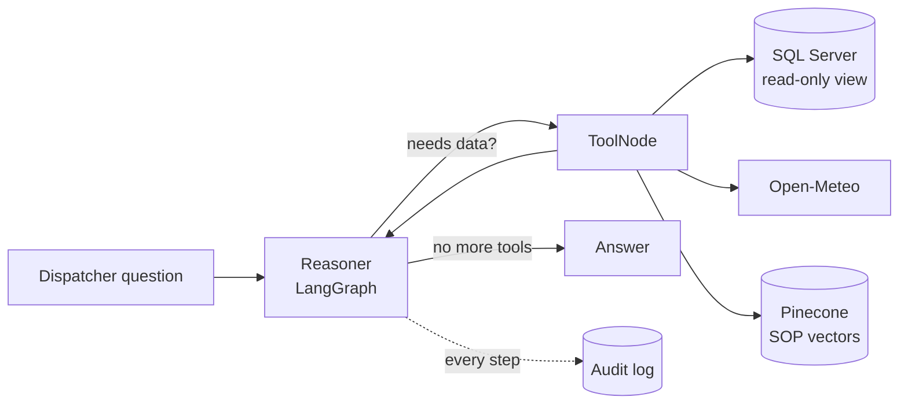

# Cold-Chain Logistics AI Assistant

A dispatcher's assistant for cold-chain logistics. Ask it a question in plain English — *"are any shipments near Los Angeles breaching the temperature SOP?"* — and it queries a SQL Server fleet database, checks live weather for the corridor, looks up the relevant compliance rule, and answers with the evidence.

Built by following [nimowhyca/cold-chain-logistics-FDE-Project](https://github.com/nimowhyca/cold-chain-logistics-FDE-Project), with small fixes of my own.

## What it does

The agent has three tools and decides for itself which to use:

| Tool | Source | Used for |
|---|---|---|
| `query_telemetry_db` | SQL Server view | Fleet position, cargo temperature, risk, delay probability |
| `fetch_corridor_conditions` | Open-Meteo API | External temperature, wind, congestion index for a location |
| `search_compliance_sop` | Pinecone vector index | The written SOP rules for temperature, congestion and escalation |



## Stack

- **Orchestration:** LangGraph — a reasoner node and a tool node, looping until the model answers without asking for a tool
- **Model:** DeepSeek (`deepseek-flash`), swappable to OpenAI or a local Ollama model through one env variable
- **Embeddings:** `BAAI/bge-m3` running locally on CPU, 1,024 dimensions
- **Vector store:** Pinecone serverless
- **Database:** SQL Server 2022 in Docker
- **UI:** Streamlit, with a chat view and an audit-log viewer

## Security model

The agent never touches the raw table. Three layers enforce this in the database itself, not in prompt instructions:

1. **A semantic view** (`FDE_VIEWS.VW_ACTIVE_FLEET`) renames legacy columns (`V_LAT`, `IOT_TEMP_VAL_C`) to readable ones (`Latitude`, `Current_Temperature_C`).
2. **A read-only login** with `SELECT` on that view only, and explicit `DENY` on the raw table and on writes to the `dbo` schema.
3. **An append-only audit log** — the agent login has `INSERT` on `FDE_VIEWS.AgentAuditLog` and cannot read or alter it. Every reasoning step and tool result is recorded.

Verified behaviour for the agent login:

| Action | Result |
|---|---|
| `SELECT` from the clean view | allowed |
| `SELECT` from the raw table | `The SELECT permission was denied` |
| `DELETE` from the raw table | `The DELETE permission was denied` |
| `SELECT` from the audit log | `The SELECT permission was denied` |
| `INSERT` into the audit log | allowed |

A `SELECT`-prefix check in the tool code is a secondary guard only. The database permissions are what actually hold.

## Data

[Logistics and supply chain dataset](https://www.kaggle.com/datasets/datasetengineer/logistics-and-supply-chain-dataset) from Kaggle: 32,065 rows, 26 columns, included in `data/raw/`. The loader keeps 9 columns and renames them to a deliberately awkward legacy schema, so the project has something realistic to clean up.

Note that the readings span 2022 to 2024. The view is called `VW_ACTIVE_FLEET`, but nothing in it is live.

## Setup

Requires Docker, Python 3.12+, and an ODBC Driver 18 for SQL Server.

**1. Start the database**

```bash
docker run -v mssql_data:/var/opt/mssql \
  -e "ACCEPT_EULA=Y" -e "MSSQL_SA_PASSWORD=<your-sa-password>" \
  -p 1433:1433 --name legacy-mssql \
  -d mcr.microsoft.com/mssql/server:2022-latest
```

**2. Install dependencies**

```bash
python3 -m venv venv && source venv/bin/activate && pip install -r requirements.txt
```

On macOS the ODBC driver comes from Homebrew: `brew tap microsoft/mssql-release && HOMEBREW_ACCEPT_EULA=Y brew install msodbcsql18`.

**3. Configure `.env`**

```
SQL_SERVER_HOST=localhost
SQL_SERVER_PORT=1433
SQL_ADMIN_USER=sa
SQL_ADMIN_PASSWORD=<your-sa-password>
SQL_AGENT_USER=USR_FDE_RO
SQL_AGENT_PASSWORD=<your-agent-password>
Embeddings_model=LOCAL
Agent_llm=DEEPSEEK
PINECONE_API_KEY=<key>
DEEPSEEK_API_KEY=<key>
```

**4. Load the data and lock it down**

```bash
python scripts/ingest_legacy_data.py
```

Then run `scripts/setup_security_and_view.sql` as `sa` — it creates the view, the read-only login and the permissions. Change the password inside the script before running it. Create the audit table as `sa`:

```sql
CREATE TABLE FDE_VIEWS.AgentAuditLog (
    LogID INT IDENTITY(1,1) PRIMARY KEY,
    Timestamp DATETIME DEFAULT GETDATE(),
    SessionID VARCHAR(50),
    NodeExecuted VARCHAR(50),
    ToolName VARCHAR(100),
    Content NVARCHAR(MAX)
);
GRANT INSERT ON FDE_VIEWS.AgentAuditLog TO USR_FDE_RO;
```

**5. Index the SOP and run the app**

```bash
python scripts/ingest_sop_pinecone.py
streamlit run src/ui.py
```

The SOP ingestion splits Markdown on its headings, then into 600-character chunks with 60 of overlap, and skips files whose hash hasn't changed since the last run.

## Known limitations

- Everything is created in SQL Server's `master` database. A real deployment would use its own database.
- `src/ui.py` sends the user's message without the system prompt in `src/prompts/system_prompt.txt`, so the web app's answers don't follow the report format that prompt defines. The terminal loop in `orchestrator.py` does use it.
- The agent keeps one conversation per session, so a tool result fetched for an earlier question can be reused for a later one. Judging tool selection needs a fresh session each time.
- There is no eval harness. Tool choice and answer quality are assessed by reading the audit log.
